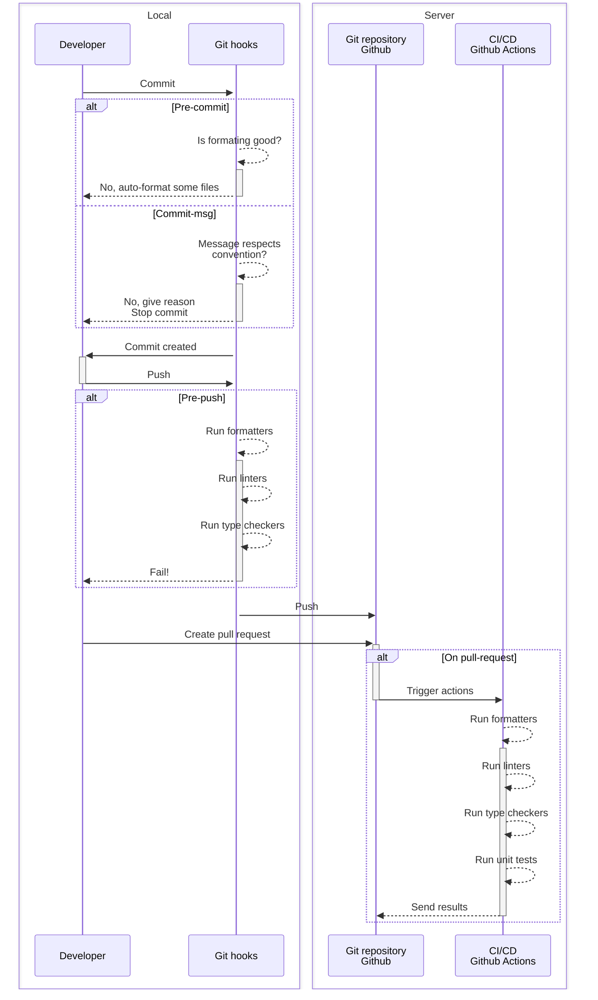

<!-- markdownlint-disable MD013 MD033-->

# Catégorisation des produits d'un boutique en ligne


[](https://python-poetry.org/)
[](https://github.com/psf/black)
[](https://github.com/astral-sh/ruff)

[](https://github.com/pre-commit/pre-commit)
[](https://open.vscode.dev/JoffreyLGT/e-commerce-mlops)
[](https://conventionalcommits.org)

API permettant de prédire la catégorie d'un produit en fonction de sa désignation, description et d'une image.


## Structure du projet

```text
E-COMMERCE-MLOPS/
├─ .devcontainer/ : fichiers du conteneur de dev
├─ .github/workflow/ : Github Actions
├─ .vscode/tasks.json : tâches du project global
├─ backend/ : Projet - API permettant aux utilisateurs de prédire la catégorie d'un produitg
├─ datascience/ : Projet - entraînement, tracking et mise à disposition des modèles de prédiction
├─ scripts/ : liste des scripts globaux du projet
│ ├─ ressources/ : contient les ressources nécessaires aux scripts
│ ├─ tests/ : sous-scripts utilisés par `run-tests.sh`
├─ dev.env : fichier de configuration de l'environnement de développement
├─ staging.env : fichier de configuration l'environnement de test
├─ template.env : version "de base" du fichier de configuration
```

## Mise en place avec Docker

1. Remplir le fichier [`.env`](.env) avec les informations du projet.
2. Toujours dans [`.env`](.env), vérifier que la valeur de la variable `TARGET_ENV` est renseignée.
3. Exécuter [`scripts/docker-deploy.sh`](scripts/docker-deploy.sh) pour créer les conteneurs.
4. Lancer les conteneurs via Docker Desktop ou via ligne de commande :

```shell
docker compose -f docker-compose.yaml up -d
```

## Configuration de l'environnement de développement

### Local

Utilisation de la machine locale pour le développement permettant l'utilisation du **GPU pour les tâches Tensorflow**.
*Actuellement configuré pour les utilisateurs de MacOS.*

Prérequis :

- Système UNIX-like (Linux, MacOS). Les utilisateurs de Windows peuvent soit utiliser le [conteneur de développement](#dev-container) mis à disposition, soit installer un système Linux sur [WSL2](https://learn.microsoft.com/fr-fr/windows/wsl/install).
- [Visual Studio Code](https://code.visualstudio.com)
- [Docker Desktop](https://www.docker.com/products/docker-desktop/)
- [Python 3.11](https://www.python.org/downloads/)
- [Poetry](https://python-poetry.org/docs/#installing-with-pipx) (installation via [pipx](https://pypa.github.io/pipx/) recommandée)
- [Pre-commit](https://pre-commit.com) pour la gestion des hook Git.

Mise en place :

1. Cloner le repo :

    ```shell
    git clone https://github.com/JoffreyLGT/e-commerce-mlops.git
    ```

2. Ouvrir VSCode
3. Cliquer sur `File`, `Open Workspace from File...`
4. Sélectionner le fichier [e-commerce-mlops.code-workspace](e-commerce-mlops.code-workspace)
5. Ouvrir le fichier [.env](.env) et vérifier que les variables d'environnement ci-dessous sont configurées avec ces valeurs :

    ```env
    USE_DB_CONTAINER=true
    DB_SERVER=localhost
    ```

6. Une fois le projet ouvert, ouvrir un terminal dans le dossier `root`, et saisir la commande ci-dessous :

    ```shell
    ./scripts/environment-setup.sh
    ```

7. Installer les [extensions recommandées dans le workspace.](#extensions)

<a id="dev-container" />

### Conteneur de développement

Utilisation d'un conteneur Docker possédant tous les outils de développement.

Voici les prérequis :

- [Visual Studio Code](https://code.visualstudio.com)
- Extension VSCode [Dev Container](https://marketplace.visualstudio.com/items?itemName=ms-vscode-remote.remote-containers)
- [Docker Desktop](https://www.docker.com/products/docker-desktop/)

Une fois les prérequis installées, veuillez-suivre les étapes suivantes :

1. Cloner le repo :

    ```shell
    git clone https://github.com/JoffreyLGT/e-commerce-mlops.git
    ```

2. Ouvrir le projet dans VSCode.
3. Ouvrir la palette des commandes (`Cmd+Shift+p`).
4. Saisir `dev open workspace` et sélectionner l'option `Dev Containers: Open Workspace in Container...`.
5. Sélectionner le fichier `e-commerce-mlops.code-workspace`.

La fenêtre de VSCode va se recharger et le conteneur de développement va se mettre en place.

Les [extensions recommandées dans le workspace](#extensions) sont installées automatiquement. Cependant, VSCode peut afficher des notifications lors de leur installation, notamment Pylance indiquant que l'extension Python n'est pas détectée. Il faut simplement les fermer sans les prendre en compte.

### Extensions

Le workspace contient une liste d'extensions recommandées. Pour les installer, ouvrir la Command Palette (`CMD + Shift + p` ou via le menu `View > Command Palette...`) et rechercher `Extensions: Show Recommended Extensions`.

Sur la ligne `WORKSPACE RECOMMENDATION`, cliquer sur `Install workspace Recommended Extensions`.

## Questions et réponses

Cette section concerne les outils en général. Chaque sous-projet a sa propre section :

- [root](#root-q&a)
- [backend](#backend-q&a)
- [datascience](#datascience-q&a)

### Docker m'indique que je le disque de la VM est plein

Docker stocke les images, containers et volumes dans un disque virtuel. Celui-ci a une taille définie dans les paramêtres de Docker Desktop.

Pour solutionner cette erreur, deux solutions :

1. Augmenter la taille du disque via Docker Desktop, rubrique `Settings`.
2. Vider tout le contenu du disque et repartir de zéro avec la commande ci-dessous :

```shell
docker system prune -a --volumes
```

### Mon ordinateur surchauffe pendant le développement / utilisation intensive du CPU

- Ouvrir le moniteur d'activité pour repérer le processus utilisant le CPU.
- S'il s'agit de `code helper (plugin)`, noter le PID.
- Quitter complètement VSCode (`Cmd + Q` sur MacOS)

    Si le processus disparait, relancer VSCode et attendre quelques minutes. Si le processus ne revient pas, tout est de nouveau en ordre. Sinon, continuer les étapes ci-dessous.

- Ouvrir un terminal et saisir la commande suivante en replaçant 67377 par le PID noté précédemment :

    ```shell
    ps aux | grep 67377
    ```

- Le résultat de la commande à le format suivant :

    ```text
    joffrey 67377 110.4  8.1 1587151776 1351248   ??  R     4:35PM  29:40.37 [...] /Users/joffrey/.vscode/extensions/ms-python.vscode-pylance-2023.8.30/dist [...]
    ```

    *Note : [...] indique que le contenu a été tronqué.*

    En analysant la ligne, nous constatons la mention `/.vscode/extensions/ms-python.vscode-pylance-2023.8.30/` : [Pylance](#language-server--pylance) est donc le coupable.

### Comment renseigner le schéma d'un fichier TOML pour bénéficier de l'auto-completion ?

- Ouvrir le site [Schemastore.org](https://www.schemastore.org/json/) et rechercher le schéma correspondant à votre fichier.
- Ouvrir votre fichier TOML.
- Insérer la valeur ci-dessous en première ligne du fichier :

    ```toml
    #:schema https://json.schemastore.org/ruff.json

    # Add your values after
    ```

### Comment tester le projet sur d'autres architectures

Nous utilisons principalement des machines ARM (Apple Silicon) pour le développement du projet.
Afin de pouvoir tester sur des machines de type AMD64, nous utilisons le conteneur de développement.

Pour cela, il faut :

- Ouvrir le fichier [.devcontainer/Dockerfile](.devcontainer/Dockerfile)
- Modifier la première ligne pour y ajouter `--platform=linux/amd64` comme ceci :

    ```dockerfile
    FROM --platform=linux/amd64 mcr.microsoft.com/devcontainers/python:1-3.11-bullseye
    ```

## Information sur les projets

Un workspace VSCode est mis à disposition à la racine du projet sous le nom *[e-commerce-mlops.code-workspace](e-commerce-mlops.code-workspace)*. **Il est fortement recommandé de l'utiliser.**

Il s'agit d'un multi-root workspace configuré pour permettre un fonctionnement optimal des sous-projets. Chaque sous-projet contient des tâches VSCode permettant d'exécuter les fonctions principales.

### root (racine du projet)

Contient les fichiers commun à tout le projet, les sous-projets ainsi que des fichiers utilisés dans les sous-projets.

### Continuous integration et Continuous delivery (CI/CD)



#### Symlinks

Attention, certains fichiers sont référencés comme symlinks dans les sous-projets:
| File      | Sub-projects                  |
| --        | --                            |
| .env      | backend, datascience          |
| mypy.ini  | backend, datascience          |
| ruff.toml | backend, datascience          |

#### VSCode Tasks (root)

Les tâches ci-dessous sont disponibles :
| Nom       | Description                |
| --        | --                            |
| Run all Git hooks  | Permet de lancer tous les hook Git sans faire d'action Git.          |
| Run Git pre-commit hooks  | Permet de lancer les hook git de pre-commit sans avoir à faire de commit.          |
| Run Git pre-push hooks  | Permet de lancer les hook Git de pre-push sans avoir à faire de commit.          |

<a id="root-q&a" />

#### Questions et réponses (root)

Rien pour le moment.

### backend

Permet de lancer l'API de catégorisation des produits.

#### Démarrage en mode développement

Le lancement de l'API en mode développement sur le conteneur se fait avec le script `start-reload.sh` :

```shell
./scripts/start-reload.sh
```

VSCode s'occupe automatiquement de la redirection du port $BACKEND_FASTAPI_PORT.
Ouvrir l’adresse ci-dessous dans un navigateur Web sur la machine hôte pour afficher la documentation :

<http://localhost:$BACKEND_FASTAPI_PORT/docs>

Une tâche portant le nom `Start API in reload mode` permet de lancer l'API en mode développement.

#### Monitoring et démarrage en mode staging / production

Le monitoring est mise en place avec la librairie [OpenTelemetry](https://opentelemetry.io) permettant l'envoi des évènements sur plusieurs solutions du marché.
Dans ce projet, nous utilisons la version Open Source de [SigNoz](https://signoz.io).

Pour démarrer l'application avec la télémétrie, il faut exécuter le script `start-with-telemetry.sh` :

```shell
./scripts/start-with-telemetry.sh
```

A noter que Signoz doit être installé sur votre machine et connecté sur le même réseau que le devcontainer.

#### Tests automatisés

Les tests sont exécutés par [Pytest](https://docs.pytest.org/en/7.4.x/). Ils se lancent soit via la fonction [Testing de VSCode](https://code.visualstudio.com/docs/python/testing#_run-tests), soit en exécutant la commande suivante :

```shell
poetry run ./scripts/start-tests.sh
```

#### Git hook

Les hook sont générés automatiquement dans le dossier [.git/hooks](.git/hooks/) par l'utilitaire [pre-commit](https://pre-commit.com) lors de l'exécution de [scripts/environment-setup.sh](scripts/environment-setup.sh).
Ceux-ci ont été sélectionnés pour être rapides et le moins intrusifs possible pour ne pas géner le workflow des développeurs.

Le projet en utilise trois types :

- pre-commit : principalement le formatage des fichiers et des vérifications statiques.
- pre-push : analyse de code statique.
- commit-msg : vérifie le message de commit pour s'assurer que celui-ci correspond à nos [standards.](#messages-de-commit)

#### VSCode Tasks (backend)

Les tâches ci-dessous sont disponibles :
| Nom       | Description                |
| --        | --                            |
| Start API in reload mode | Lance l'API en mode reload, permettant de recharger automatiquement le code lorsqu'il est modifié. |
| Check Tensorflow GPU support | Affiche un message pour indiquer si Tensorflow supporte des GPU dans l'environnement. |
| Start PostgreSQL DB container | Démarre le conteneur *db* depuis le fichier [docker-compose.yaml](docker-compose.yaml). |
| Stop PostgreSQL DB container | Stop le conteneur *db* démarré depuis la tâche Start PostgreSQL DB container. |

<a id="backend-q&a" />

#### Questions et réponses (backend)

##### Comment ajouter ou modifier une table en BDD ?

>> TLDR : Ajouter ou modifier les modèles SQLAlchemy dans `/app/models/`, les schemas Pydantic dans `/app/schemas/` et les outils CRUD d'interaction avec la BDD dans `/app/crud/`. Attention à bien mettre à jour les fichier `__init__.py` de ces modules ! Pour terminer, générer la migration alembic.
>> Utiliser **prediction_feedback** comme exemple.

1. Création du modèle SQLAlchemy

    Créer un nouveau fichier `{{tableobjet}}.py` dans le dossier`/app/models`.
    Définir la classe en utilisant SQLAlchemy et en la faisant hériter de la classe`app.database.base_class.Base`.

    Importer la classe dans le fichier `/app/models/__init__.py`. Cela permet d'avoir une meilleure syntaxe d'import dans les autres fichiers.

    Importer la classe dans le fichier `/app/database/base.py`. L'objectif ici est que la classe soit disponible lors de l'import de la classe Base dans la configuration alembic.

2. Création du schéma Pydantic

    Créer un nouveau fichier `{{tableobjet}}.py` dans le dossier `/app/schemas`. Ouvrir le fichier `/app/schemas/prediction_feedback.py` et copier son contenu dans le nouveau fichier créé. Changer les classes pour qu'elles correspondent aux données du nouvel objet.

    Importer la classe dans le fichier `/app/schemas/__init__.py`. Cela permet d'avoir une meilleure syntaxe d'import dans les autres fichiers.

3. Création du CRUD

    Ce fichier va contenir les fonctions permettant d'interagir avec BDD.

    Créer un nouveau fichier `crud_{{tableobjet}}.py` dans le dossier `/app/crud`. Ouvrir le fichier `/app/crud/crud_prediction_feedback.py` et copier son contenu dans le nouveau fichier créé. Changer les types pour renseigner ceux précédemment créés.

    Ne pas oublier de terminer le fichier par l'instanciation de la classe dans une variable.

    Importer la variable dans le fichier `/app/crud/__init__.py`. Cela permet d'avoir une meilleure syntaxe d'import dans les autres fichiers.

4. Génération de la migration alembic

    Ouvrir un nouveau terminal et saisir la commande suivante :

    ```shell
    alembic revision --autogenerate -m "{{description of what you did}}"
    ```

    La migration s'appliquera automatiquement lors du prochain redémarrage du dev container. Pour l'appliquer directement et, donc, mettre à jour la BDD, saisir la commande suivante :

    ```shell
    alembic upgrade head
    ```

    Si besoin, il est possible de revenir en arrière sur les migrations en utilisant la commande :

    ```shell
    alembic downgrade {{identifiant_révision}}
    ```

    Ou de revenir en arrière sur toutes les migrations via la commande :

    ```shell
    alembic downgrade base
    ```

### datascience

#### Création d'un jeu de données

En partant du principe que toutes les données ont été stockées dans le dossier `data/datasets/original` avec la structure suivante :

```text
original
├── X.csv
├── y.csv
└──── images
   ├── image_977803476_product_278535420.jpg
   ├── image_1174586892_product_2940638801.jpg
   └── [...]
```

- `X.csv` contient les features, à savoir les informations sur le produit dans les colonnes `désignation`, `description`, `productid` et `imageid`.
- `y.csv` contient la target, à savoir la catégorie du produit dans une colonne.
- `images` contient toutes les images des produits. Les images doivent respecter la convention `image_[imageid]_[productid].jpg`

Pour créer un dataset (jeu de données) pour l'entrainement, utiliser le script [create_datasets.py](datascience/scripts/create_datasets.py).

```bash
# Depuis le dossier e-commerce-mlops/datascience
python -m scripts.create_datasets --train-size 0.8 --test-size 0.2 --input-dir "data/originals" --output-dir "data/datasets/example"
```

Le script va s'occuper de traiter les images pour retirer les bandes blanches inutiles, les redimentionner et va créer les jeux de données d'entrainement (80%) et de test (20%) au format `.csv`.

#### Entrainement d'un modèle

Le projet utilise 3 modèles (image, texte et fusion). De ce fait, 3 scripts sont mis à disposition pour l'entrainement :

- [train_image_model.py](datascience/scripts/train_image_model.py)
- [train_text_model.py](datascience/scripts/train_text_model.py)
- [train_fusion_model.py](datascience/scripts/train_fusion_model.py)

Ceux-ci utilisent [MLFlow](https://mlflow.org) pour le suivi des metrics.

Chaque script est documenté. Pour afficher l'aide, utiliser la commande `--help`.  
Exemple :

```bash
# Affiche l'aide du script train_image_model.py
python -m scripts.train_image_model --help
```

Ce qui affiche :

```text
usage: train_image_model.py [-h] [--input-dir INPUT_DIR] [--output-dir OUTPUT_DIR] [--batch-size BATCH_SIZE]
                            [--no-data-augmentation] [--train-patience TRAIN_PATIENCE] [--epochs EPOCHS] [--set-staging]
                            [--registered-model REGISTERED_MODEL]

Create and train a new image model using dataset provided with --input-dir, then save it to --output-dir with its performance
statistics.

required arguments:
  --input-dir INPUT_DIR
                        Directory containing the datasets to use.
  --output-dir OUTPUT_DIR
                        Directory to save trained model and stats.

optional arguments:
  --batch-size BATCH_SIZE
                        Size of the batches to use for the training. Set as much as your machine allows. (default: 96)
  --no-data-augmentation
                        Add layers of data augmentation to avoid early overfitting. (default: True)
  --train-patience TRAIN_PATIENCE
                        Number of epoch to do without improvements before stopping the model training. (default: 10)
  --epochs EPOCHS       Number of epochs to reach before stopping. Stops before if train-patience is reached. (default: 100)
  --set-staging         Set new model version status as staging for 'fusion' model (default: False)
  --registered-model REGISTERED_MODEL
                        (default: image)

help:
  -h, --help            show this help message and exit
```

#### Mise en ligne d'une nouvelle version du modèle

1. Dans un terminal, lancer l'interface graphique de MLFlow avec la commande suivante :

    ```bash
    mlflow ui
    ```

2. Dans l'en-tête, cliquer sur `Experiments`.
3. Rechercher le run du modèle à mettre en production et cliquer dessus.
4. Dans la liste des `artifacts`, cliquer sur le modèle, puis sur `Register Model`.
5. Dans la popup qui s'ouvre, sélectionner le modèle en question, puis cliquer sur `Register`.
6. Dans l'en-tête, cliquer sur le modèle, puis sur la version.
7. Le champ `Stage` permet de changer le statut du modèle (`Staging` pour test, `Production` pour production.
8. Utiliser la commande ci-dessous pour lancer le modèle :

    ```bash
    # Remplacer image par le nom du modèle, et Staging par Production pour une mise en production
    mlflow models serve -m "models:/fusion/Staging" --port 5002 --env-manager local
    ```

#### Envoyer une requête sur le modèl

- Exemple de requête pour effectuer une prédiction sur le modèle Fusion :

<details>
<summary>Cliquer ici pour afficher la requête.</summary>

```bash
curl --location 'localhost:5002/invocations' \
--header 'Content-Type: application/json' \
--data '{
    "dataframe_records": [
        {
            "product_id": "1",
            "designation": "",
            "description": "",
            "image_path": "/Users/joffrey/workspace/e-commerce-mlops/datascience/data/datasets/subset_1/images/image_62350930_product_2242045.jpg"
        },
        {
            "product_id": "2",
            "designation": "Jeux Xbox",
            "description": "",
            "image_path": ""
        },
        {
            "product_id": "3",
            "designation": "",
            "description": "Jeux Xbox Elder scrolls",
            "image_path": ""
        },
        {
            "product_id": "4",
            "designation": "Jeux Xbox Elder scrolls",
            "description": "UN RPG comme on les aimes !",
            "image_path": "/Users/joffrey/workspace/e-commerce-mlops/datascience/data/datasets/subset_1/images/image_62350930_product_2242045.jpg"
        },
        {
            "product_id": "5",
            "designation": "",
            "description": "",
            "image_path": ""
        }
    ]
}'
```

</details>
<br/>

- Le résultat contient l'objet JSON suivant :

<details>
<summary>Cliquer ici pour afficher le résultat.</summary>

```json
{
    "predictions": [
        {
            "product_id": "2",
            "10": "3.64",
            "1140": "3.62",
            "1160": "3.68",
            "1180": "3.59",
            "1280": "3.77",
            "1281": "3.76",
            "1300": "3.76",
            "1301": "3.62",
            "1302": "3.71",
            "1320": "3.72",
            "1560": "3.81",
            "1920": "3.68",
            "1940": "3.65",
            "2060": "3.72",
            "2220": "3.56",
            "2280": "3.77",
            "2403": "3.78",
            "2462": "3.72",
            "2522": "3.74",
            "2582": "3.7",
            "2583": "3.81",
            "2585": "3.72",
            "2705": "3.66",
            "2905": "3.68",
            "40": "3.78",
            "50": "3.69",
            "60": "3.63"
        },
        {
            "product_id": "3",
            "10": "3.64",
            "1140": "3.62",
            "1160": "3.68",
            "1180": "3.59",
            "1280": "3.77",
            "1281": "3.76",
            "1300": "3.76",
            "1301": "3.62",
            "1302": "3.71",
            "1320": "3.72",
            "1560": "3.81",
            "1920": "3.68",
            "1940": "3.65",
            "2060": "3.72",
            "2220": "3.56",
            "2280": "3.77",
            "2403": "3.78",
            "2462": "3.72",
            "2522": "3.74",
            "2582": "3.7",
            "2583": "3.81",
            "2585": "3.72",
            "2705": "3.66",
            "2905": "3.68",
            "40": "3.78",
            "50": "3.69",
            "60": "3.63"
        },
        {
            "product_id": "1",
            "10": "3.73",
            "1140": "5.61",
            "1160": "4.71",
            "1180": "1.12",
            "1280": "3.51",
            "1281": "3.32",
            "1300": "3.67",
            "1301": "1.86",
            "1302": "2.99",
            "1320": "3.01",
            "1560": "2.44",
            "1920": "3.8",
            "1940": "1.8",
            "2060": "4.0",
            "2220": "1.58",
            "2280": "4.18",
            "2403": "7.22",
            "2462": "2.65",
            "2522": "10.68",
            "2582": "2.85",
            "2583": "8.72",
            "2585": "3.77",
            "2705": "2.87",
            "2905": "2.93",
            "40": "3.28",
            "50": "1.47",
            "60": "2.22"
        },
        {
            "product_id": "4",
            "10": "5.84",
            "1140": "3.09",
            "1160": "4.33",
            "1180": "1.84",
            "1280": "4.01",
            "1281": "3.33",
            "1300": "4.7",
            "1301": "1.03",
            "1302": "0.7",
            "1320": "4.26",
            "1560": "2.84",
            "1920": "7.49",
            "1940": "1.08",
            "2060": "8.53",
            "2220": "1.53",
            "2280": "4.61",
            "2403": "6.52",
            "2462": "1.38",
            "2522": "5.42",
            "2582": "5.24",
            "2583": "8.53",
            "2585": "1.88",
            "2705": "3.86",
            "2905": "1.41",
            "40": "2.53",
            "50": "2.7",
            "60": "1.33"
        },
        {
            "product_id": "2",
            "10": "",
            "1140": "",
            "1160": "",
            "1180": "",
            "1280": "",
            "1281": "",
            "1300": "",
            "1301": "",
            "1302": "",
            "1320": "",
            "1560": "",
            "1920": "",
            "1940": "",
            "2060": "",
            "2220": "",
            "2280": "",
            "2403": "",
            "2462": "",
            "2522": "",
            "2582": "",
            "2583": "",
            "2585": "",
            "2705": "",
            "2905": "",
            "40": "",
            "50": "",
            "60": ""
        },
        {
            "product_id": "3",
            "10": "",
            "1140": "",
            "1160": "",
            "1180": "",
            "1280": "",
            "1281": "",
            "1300": "",
            "1301": "",
            "1302": "",
            "1320": "",
            "1560": "",
            "1920": "",
            "1940": "",
            "2060": "",
            "2220": "",
            "2280": "",
            "2403": "",
            "2462": "",
            "2522": "",
            "2582": "",
            "2583": "",
            "2585": "",
            "2705": "",
            "2905": "",
            "40": "",
            "50": "",
            "60": ""
        },
        {
            "product_id": "5",
            "10": "",
            "1140": "",
            "1160": "",
            "1180": "",
            "1280": "",
            "1281": "",
            "1300": "",
            "1301": "",
            "1302": "",
            "1320": "",
            "1560": "",
            "1920": "",
            "1940": "",
            "2060": "",
            "2220": "",
            "2280": "",
            "2403": "",
            "2462": "",
            "2522": "",
            "2582": "",
            "2583": "",
            "2585": "",
            "2705": "",
            "2905": "",
            "40": "",
            "50": "",
            "60": ""
        }
    ]
}
```

</details>

<a id="datascience-q&a" />

#### Questions et réponses (datascience)

Rien pour le moment

## Normes de développement

### Git

#### Pull Request

Les PR doivent obligatoirement être liées à une issue et avoir une description permettant d'aider le validateur dans ses tests.

#### Messages de commit

Nous utilisons la convention [Conventional Commits](https://www.conventionalcommits.org/en/v1.0.0/).

Une extension VSCode est recommandée dans le workspace permettant de rédiger les messages façilement. Pour l'utiliser :

1. Ouvrir la palette des commandes (`Cmd+Shift+p`).
2. Cliquer sur `Conventional Commits`.
3. Suivre les indication.

Le message de commit sera alors automatiquement ajouté dans la vue [`Source control`](https://code.visualstudio.com/docs/sourcecontrol/overview).

### Python

Le dev container est configuré pour installer et configurer automatiquement les extensions VSCode.

#### Commentaires

Doivent être rédigés en anglais.

#### Language server : Pylance

Parfois, Pylance indique des erreurs de type à cause de décorateurs des librairies. C'est le cas notamment de la propriété `__tablename__` de SQLAchemy.

Pour ignorer ces erreurs, ajouter le commentaire suivant en bout de ligne :

```python
__tablename__ = "prediction_feedback" # pyright: ignore
```

#### Docstring : Google

Nous utilisons la convention de [Google expliquée ici](https://google.github.io/styleguide/pyguide.html#s3.8-comments-and-docstrings).

L'extension autoDocstring, intégrée au dev container, permet de générer les templates de docstring via la commande (Cmd + Shift + p) `Generate Docstring`.

#### Analyseur de code statique : Ruff

[Ruff](https://beta.ruff.rs/docs/) effectue l'analyse de code statique du fichier en direct et fait des recommandations. Il combine des règles provenant de plusieurs autres linter du marché et réorganise les imports en utillisant les règles [iSort](https://beta.ruff.rs/docs/faq/#how-does-ruffs-import-sorting-compare-to-isort).

Les configurations, incluant les règles activées, se trouvent dans le fichier des configuration Ruff : [`ruff.toml`](ruff.toml).

Certaines recommandations peuvent être érronées. Pour les désactiver, consulter la page  [Ruff error suppression](https://beta.ruff.rs/docs/configuration/#error-suppression).

Il est recommandé d'ajouter un message pour expliquer pourquoi la règle est désactivée.

#### Formateur Python: Black

[Black](https://black.readthedocs.io/en/stable/) formate automatiquement le code lors de l'enregistrement du fichier.

Les configurations se trouvent dans les fichier `pyproject.toml` de chaque sous-projet.

#### Vérificateur de type : Mypy

[Mypy](https://mypy.readthedocs.io/en/stable/) s'occupe de mettre en avant les potentiels problèmes liés aux types.

Il s'exécute à l'enregistrement du fichier.

Les configurations se trouvent dans le fichier [`mypy.ini`](mypy.ini).
